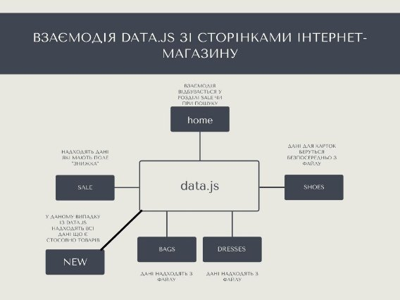

МІНІСТЕРСТВО ОСВІТИ І НАУКИ УКРАЇНИ

Національний Технічний Університет України

«Київський Політехнічний Інститут»

Факультет інформатики та обчислювальної техніки

Кафедра обчислювальної техніки

**Лабораторна робота №2**

з дисципліни «Організація баз даних»

**на тему: «Виявлення вимог до функціональності програми. Розробка моделі прецендентів»**

**Виконала:**

студентка 2-го курсу ФІОТ

групи ІО-з01

Манзенко С.С.

Залікова книжка №0111

**Перевірив:**

Доцент 

Кандидат технічних наук

Болдак О.А

**Київ – 2022**

**Мета:** вивчення вимог до програмного проекту, структури документів та програмної системи, формування моделі прецедентів.

**Довідка**

Розробка концептуальної моделі предметної області є першим найважливішим етапом розробки програмної системи, оскільки визначає узагальнене уявлення про інформацію її кінцевих користувачів.

**Визначення цілі, перетворення системи**

База даних є частиною програмної системи, тому для її розробки необхідно проаналізувати вимоги до системи в цілому.

**Етапи розробки баз даних:**

1. Діаграми Use Case
1. Специфікація, сценарій, Sequence-діаграми

***Прецедент (англ. Use Case)*** – список етапів, що послідовно описує взаємодію системи з користувачем та використовується для досягнення певної мети, визначеної дійовою особою (англ. Actor).

Прецеденти слугують для документування функціональних вимог до програмних систем. Описуючи деякий цілісний фрагмент поведінки системи, прецедент не вдається в особливості внутрішньої структури суб’єкта. Визначення прецеденту містить всі властиві йому види поведінки: основну послідовність, різноманітні варіанти стандартної поведінки та різні виключні ситуації із зазначенням відповідної реакції на них.

На діаграмах прецедентів в UML Use Case зображується у вигляді еліпса, всередині якого (або під ним) вказується ім’я елемента.

До прецедентів в UML застосовні наступні види відношень:

- ***Асоціація (англ. Association)*** – вказує на те, що Actor ініціює відповідний варіант використання.
- ***Розширення (англ. Extend)*** – різновид відношення залежності між базовим варіантом використання та його частковим випадком.
- ***Включення (англ. Include)*** – визначає зв'язок базового варіанта використання з іншим, функціональна поведінка якого завжди задіюється базовим варіантом.
- ***Узагальнення (англ. Generalization, наслідування)*** – моделює відповідну спільність ролей.

***Actor*** – діюча особа (користувач, система, програма), спроможна приймати рішення та взаємодіяти з розроблюваною системою.

***Діаграма Use Case*** – абстраговане представлення компонентів бази даних, дій та зв’язків між ними.

***Специфікация*** - це формалізований опис властивостей, характеристик і функцій об'єктів.

**Діаграми** 

**(послідовності, use case, специфікації)**

Всі можливі прецеденти поведінки користувача (взаємодія з інтерфейсом)

Рис 1

Опис дій користувача:

1. Користувач заходить на головну сторінку інтернет-магазину
1. Далі відбувається один із 5 сценаріїв (рис 1) 
1. Якщо взяти перший сценарій розвиток подій відбуватиметься таким чином як на рис.2

Якщо вибрати перший сценарій – алгоритм дій буде як на рис.2

Рис 2

Є певний зв’язок між прецедентами поведінки користувача (див рис 3)

Результатом всіх прецендентів є  наступні дії : 

1. Додати товар у список бажань
1. Додати товар у кошик

Всі сценарії мають між собою зв'язок. Прикладом є ситуація, коли після перегляду сторінки (пункт 1) користувач переходить на сторінку акційних товарів або шукає товар по категорії товарів у навігаційній панелі.

Дані для всіх сторінок підгружаються з бази даних або локального файлу даних. Якщо користувач зацікавлений у товарі він опиняється на сторінці картки товару, яка для кожного товару створюється динамічно шляхом отримання даних із localStorage (сховище браузера). Даний етап є спільним у всіх сценаріїв, які починаються спочатку по-різному. (рис 3).

Рис 3

Єдиним спільним результатом для двох попердніх дій є кнопка оформити замовлення (рис 4)

Рис 4

Якщо роль бази даних виконує локальний файл, то взаємодія файлу зі сторінками інтернет-магазину відбувається таким чином (див. рис 5).

Рис 5

Весь час коли користувач шукає товар на сайті чи додає їх у корзину чи у список бажань, коли переходить з однієї сторінки на іншу - сторінка заповнюється даними про товар які бере з бази даних. 

Вся інформація про товари знаходиться або локально у файлі data.js який є масивом об’єктів з полями, які характеризують товар(локальна база даних) або з бази даних MySQL. 

Як тільки користувач натискає на кнопку «купити» відбувається наступне:

Дані про товар надходять до бази даних, разом з телефоном та електронною поштою користувача. Адміністратор аналізує їх та підтверджує замовлення або відхиляє його, у разі підтвердження передає дані про замовлення фасувальнику товарів.(рис 6).

Якщо ж адміністратор відхиляє замовлення з тієї чи іншої причини покупець все-одно отримує відповідь.

У будь-якому разі покупець(користувач) отримує відповідь. У разі успішного замовлення – це буде підтвердження замовлення на пошту. У разі не успішного замовлення повідомлення на пошту.

Рис 6

**Висновки**

Вивчення вимоги до програмного проекту, структуру документів та програмної системи, сформувала моделі всіх можливих прецедентів.Створила діаграми use case, послідовностей, специфікацій.
