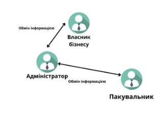
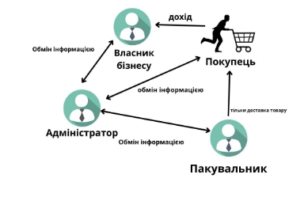
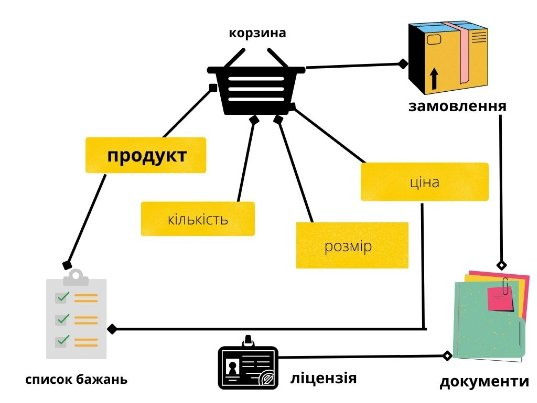
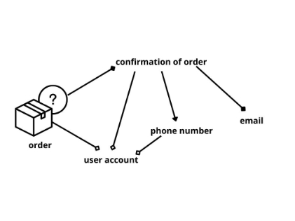
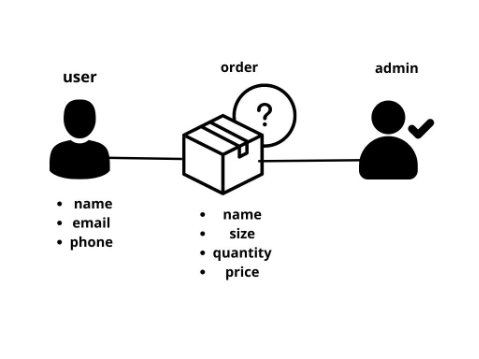
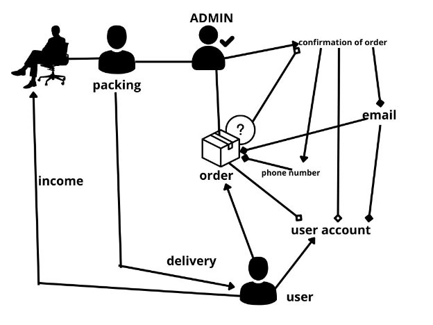

МІНІСТЕРСТВО ОСВІТИ І НАУКИ УКРАЇНИ

Національний Технічний Університет України

«Київський Політехнічний Інститут»

Факультет інформатики та обчислювальної техніки

Кафедра обчислювальної техніки

**Лабораторна робота №3**

з дисципліни «Організація баз даних»

**на тему: «Розробка моделі бізнес-об’єктів»**

**Виконала:**

студентка 2-го курсу ФІОТ

групи ІО-з01

Манзенко С.С.

Залікова книжка №0111

**Перевірив:**

Доцент 

Кандидат технічних наук

Болдак О.А

**Київ – 2022**

**Мета:** Зрозуміти сутність бізнес-моделювання. Отримати навички розробки моделі бізнес-об’єктів та словника предметної області.

**Довідка**

***Бізнес-моделювання (ділове моделювання)*** - діяльність з формування моделей організацій, що включає опис ділових об'єктів (підрозділів, посад, ресурсів, ролей, процесів, операцій, інформаційних систем, носіїв інформації і т.д.) і вказівка зв'язків між ними. Вимоги до моделей, що формуються та їх відповідне утримання визначаються цілями моделювання.

Бізнес-моделюванням також називають дисципліну і окремий підпроцес в процесі розробки програмного забезпечення, в якому описується діяльність компанії та визначаються вимоги до системи - ті підпроцеси та операції, що підлягають автоматизації розробки в інформаційній системі.

***Бізнес-об’єкт*** представляє значну і постійну частину інформації, керованої бізнес-акторами і виконавцями. Бізнес-об’єкти пасивні, тобто, вони не ініціюють взаємодії самі по собі. Бізнес-об’єкт може бути використаний в безлічі різних реалізацій бізнес-прецедентів і зазвичай реагує на будь-яку одиничну взаємодію. Бізнес-об’єкти забезпечують основу для поділу інформації (потоку документів) серед виконавців, що беруть участь в різних реалізаціях бізнес-прецедентів.

Бізнес-об’єкти являють абстракцію важливої постійної інформації в бізнес-системі. Будь-яка частина інформації, яка є властивістю чого-небудь ще, ймовірно не є бізнес-об’єктом в дійсності.

Бізнес-аналітик відповідає за ідентифікацію та опис бізнес-об’єктів, а також за визначення впливу організаційних змін на інформацію, створену і необхідну бізнес-системою. Бізнес-об’єкти також використовуються системними аналітиками та дизайнерами при описі системних прецедентів та ідентифікації програмних об’єктів відповідно.

Метою моделювання бізнес-об’єктів та їх станів є використання моделей бізнес-об’єктів та їх станів при проектуванні переліку вхідних / вихідних сигналів і даних, інтерфейсу користувача, баз даних (БД), класів, які реалізують функції системи.

Бізнес-об’єкт (business entity), представляє абстракцію суті реального світу. Прикладами бізнес-об’єктів можуть бути заявка на кредитування, договір, угода і т.д.

Модель з описом бізнес-об’єктів повинна будуватися на основі опису бізнес-процесів. Бізнес-об’єкти повинні моделюватися в розбивці по бізнес-процесам. При створенні програмної системи моделюватися повинні тільки бізнес-об’єкти, пов'язані з діяльностями, що підлягають автоматизації.

Для створення опису документів / бізнес-об’єктів використовується компоненти діаграми класів / функцій:

- пакет (package);
- бізнес сутність (business entity);
- асоціативний зв'язок (association);
- зв'язок агрегація (agregation);
- зв'язок композиція (composition);
- зв'язок спадкування або батько нащадок (generalization).

***Пакет*** використовується для групування бізнес об’єктів.

**Завдання**

1.Вивичити основні концепції бізнес моделювання. Вільно володіти термінологією: бізнес-об’єкт, словник предметної області, їх сутність та призначення.

2.Виділити з Use CASE запити зацікавлених осіб.

3.Виділити об'єкти, над якими відбуівються дії, та їхні атрибути.

4.Визначити співвідношення між вище згаданими компонентами

5.Зробити розбивку на пакети, якщо це необхідно.

6.Побудувати діаграму бізнес-об’єктів.

7.Розробити словник предметної області

**ВИКОНАННЯ ЗАВДАНЬ**

Взаємодія між співробітниками інтернет-магазину

Взаємодія між співробітниками та клієнтами

Якщо брати за модель взаємовідносини між всіма акторами бізнес-моделі можна побачити, що обмін інформацією відбувається наступним чином:

**Власник – адміністратор & адміністратор – власник (замовник)**

Власник контактує з адміністратором з приводу пропозицій оновлення бази товарів, інформації про них, доходу тощо. 

Адміністратор в свою чергу бере на себе відповідальність за передачу даних про товар на UI покупцеві.

**Адміністратор – пакувальник & пакувальник – адміністратор** 

Адміністратор передає дані про замовлення від покупця пакувальнику, вказівки від власника з приводу упаковки на свята тощо. Пакувальник же в свою чергу повідомляє адміністратора про вже віправлений чи упакований товар для того, щоб адмін заніс інформацію у базу даних.

**Пакувальник – покупець**

У даному випадку відносини односторонні. Пакувальник надсилає покупцеві товар на вказану адресу від адміністратора.

**Адміністратор-покупець & покупець -адміністратор**

Всі дані введені покупцем на сайті адміністратор отримує за допогою бази даних. Також адміністратор надсилає підтвердження замовлення та інформацію про доставку: номер ТТН тощо.

Якщо товару немає у наявності адміністратор повідомляє про це покупця.

**Власник бізнесу & покупець**

Відносини є односторонніми: власник отримує від покупця тільки дохід на реквізити компанії.

**Об’єкти над якими відбуваються дії** 

Окремо слід виділити об’єкти інтернет-магазину над якими відбуваються дії в процесі замовлення, які мають окремі компоненти, що потрібні користувачу для здійснення замовлення або компоненти, що не впливають на результат замовлення.

Співвідношення між компонентами замовлення інтернет-магазину

**Замовлення**

**Діаграма бізнес об’єктів**

На діаграмі позначено дійових осіб та на що впливає замовлення покупця через аккаунт та беспосередньо на сайті. Обов’язковими для замовлення є наявність покупця, наявність підтвердження замовлення від адміністратора.

Обов’язковою умовою для підтвердження замовлення є наявність хоча б електронної пошти користувача.

Покупець може одержати замовлення через оформлення замовлення на сайті та отримати підтвердження. Пакувальник в свою чергу надсилає замовлення покупцю. Зв’язок між власником бізнесу та покупцем відбувається внаслідок отримання від покупця доходу від продажу товарів. Покупцю не обов’язково створювати аккаунт для покупки, достатньо надати контактні дані, зокрема обов’язкова електронна адреса.

**Словник предметної області**

**Confirmation of order –** лист, який надсилається на пошту після підтверження замовлення.

**Income** – дохід від продажу товарів на сайті інтернет-магазину.

**Order** – замовлення покупця, що містить один або більше товарів.

**User –** покупець на сайті інтернет-магазину.

**Документи** – у електронному варіанті підтверджують те, що замовлення було здійснене.

**Корзина –** сторінка інтернет-магазину, що відповідає за збереження даних товарів, які були обрані покупцем.

**Ліцензія** – це право росповсюджувати той чи інший товар, бути дистрибютором.

**Продукт** – будь-який товар на сайті.

**Список бажань** – сторінка інтернет-магазину на якій відображуються товари які у майбутньому покупець планує придбати.

**Висновки**

Зрозуміла сутність бізнес-моделювання. Отримала навички розробки моделі бізнес-об’єктів та словника предметної області.
