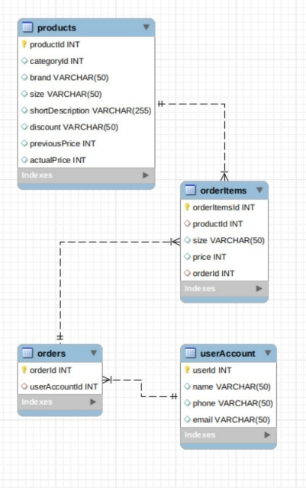
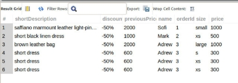

МІНІСТЕРСТВО ОСВІТИ І НАУКИ УКРАЇНИ

Національний Технічний Університет України

«Київський Політехнічний Інститут»

Факультет інформатики та обчислювальної техніки

Кафедра обчислювальної техніки

**Лабораторна робота №5**

з дисципліни «Організація баз даних»

**на тему: «Реалізація бази даних засобами MySQL»**

**Виконала:**

студентка 2-го курсу ФІОТ

групи ІО-з01

Манзенко С.С.

Залікова книжка №0111

**Перевірив:**

Доцент 

Кандидат технічних наук

Болдак О.А

**Київ – 2022**

**МЕТА:** навчитися встановлювати та налаштовувати системи розробки баз даних MySQL та Oracle SQL Developer.

**ДОВІДКА**

**Встановлення та налаштування серверу баз даних**

Сервер БД обслуговує базу даних і відповідає за цілісність і збереження даних, а також забезпечує операції введення-виведення при доступі клієнта до інформації.

Архітектура клієнт-сервера складається з клієнтів і серверів. Основна ідея полягає в тому, щоб розміщувати сервери на потужних машинах, а додаткам, що використовують мовні компоненти СУБД, забезпечити доступ до них з менш потужних машин-клієнтів за допомогою зовнішніх інтерфейсів.

Більшість СУБД використовують мову SQL (Structured Query Language - мова структурованих запитів), так як вона зручна для опису логічних підмножин БД.

Призначення SQL:

- Створення БД і таблиці з повним описом їх структури;
- Виконання основних операцій маніпулювання даними (такі як вставка, модифікація і видалення даних з таблиць);
- Виконання простих і складних запитів.

Одна з ключових особливостей мови SQL полягає в тому, що з її допомогою формуються запити, що описують яку інформацію з бази даних необхідно отримати, а шляхи вирішення цього завдання програма визначає сама.

**MySQL**

MySQL - вільна система управління базами даних (СКБД). MySQL є власністю компанії Oracle Corporation, що отримала її разом з поглинанням Sun Microsystems, що здійснює розробку і підтримку програми. Розповсюджується під GNU General Public License або під власною комерційною ліцензією.

Гнучкість СУБД MySQL забезпечується підтримкою великої кількості типів таблиць: користувачі можуть вибрати як таблиці типу MyISAM, що підтримують повнотекстовий пошук, так і таблиці InnoDB, що підтримують транзакції на рівні окремих записів. Більш того, СУБД MySQL поставляється із спеціальним типом таблиць EXAMPLE, що демонструє принципи створення нових типів таблиць. Завдяки відкритій архітектурі і GPL-ліцензуванню, в СУБД MySQL постійно з'являються нові типи таблиць.

MySQL портована на велику кількість платформ: AIX, BSDi, FreeBSD, HP-UX, Linux, Mac OS X, NetBSD, OpenBSD, OS / 2 Warp, SGI IRIX, Solaris, SunOS, SCO OpenServer, SCO UnixWare, Tru64, Windows 95, Windows 98, Windows NT, Windows 2000, Windows XP, Windows Server 2003, WinCE, Windows Vista і Windows 7.

MySQL має API для мов Delphi, C, C + +, Ейфель, Java, Лісп, Perl, PHP, PureBasic, Python, Ruby, Smalltalk, Компонентний Паскаль і Tcl бібліотеки для мов платформи. NET

**Завдання**

Вивчити основи мови структурних запитів SQL, недоліки та переваги мови, цілі створення, стандарт-ревізії, сумісність мови.

Детально вивчити основні команди SQL та їх особливості. Вільно володіти такими командами Select, Insert, Update.

Створити базу даних. Виконати зміну бази по варіанту.

**ВИКОНАННЯ ЗАВДАНЬ**

**База даних для інтернет-магазину**

create database internetshop1;

-- userAccount

create table internetshop1.userAccount(

userId int primary key,

name varchar(50),

phone varchar(50),

email varchar(50)

);

-- one order

create table internetshop1.orders(

orderId int primary key,

userAccountId int,

foreign key (userAccountId) references userAccount(userId)

);

-- a product

create table internetshop1.products(

productId int primary key,

categoryId int,

brand varchar(50),

size varchar(50),

shortDescription varchar(255),

discount varchar(50),

previousPrice varchar(50),

actualPrice varchar(50)

);

create table internetshop1.orderItems(

orderItemsId int primary key,

productId int,

size varchar(50),

price varchar(50),

orderId int,

foreign key (productId) references products(productId),

foreign key (orderId) references orders(orderId)

);

-- change a datatype of the table`s column

USE internetshop1;

ALTER TABLE products MODIFY previousPrice INTEGER;

ALTER TABLE products MODIFY actualPrice INTEGER;

ALTER TABLE orderItems MODIFY price INTEGER;

-- how to delete the table

DROP table sys.Categories;

DROP table sys.userAccount;

DROP table internetshop1.userAccount;

DROP table internetshop1.orders;

DROP table internetshop1.Product;

-- to insert multiple values into the table

INSERT INTO internetshop1.userAccount(userId, name, phone, email)

values(1, 'Sofi', '5554477', 'sofi.mann99@gmail.com'),

(2, 'Mark', '88999777', 'mark@gmail.com'),

(3, 'Adrew', '8855666', 'andrew@gmail.com');

INSERT INTO internetshop1.orders(orderId, userAccountId)

values (1, 1), (2, 2), (3,3);

INSERT INTO internetshop1.products(productId, categoryId, brand, size, shortDescription, 

discount, previousPrice, actualPrice)

values(1, 4, 'gucci', 'small','saffiano marmount leather light-pink bag', '-50%', 1000, 2000),

(2, 5,'faithfull', 'xs', 'short black linen dress', '-50%', 1000, 500),

(3, 4, 'gucci', 'large', 'brown leather bag', '-50%', 2000, 1000),

(4, 5, 'selfportrait', 's', 'short dress', '-50%', 600, 300),

(5, 5, 'parosh', 'xs', 'short dress', '-50%', 600, 300);

-- to update data in the table column

SELECT \*

FROM products

WHERE productId=1;

UPDATE products

SET previousPrice = 2000, actualPrice = 1000

WHERE productId=1;

-- orders

INSERT INTO internetshop1.orderItems(orderItemsId, productId, size, price, orderId)

values(1, 1, 'small', 1000, 1),

(2, 2, 'xs', 500, 2),

(3, 3, 'large', 1000, 3);

-- to show orders of every user in database (if every user made only one order)

use internetshop1;

SELECT \* 

FROM orders o

JOIN userAccount ua

ON o.userAccountId = ua.userId

JOIN orderItems oi

ON oi.orderId = o.orderId

JOIN products p

ON p.productId = oi.productId;

-- user made two or more orders

INSERT INTO internetshop1.orderItems(orderItemsId, productId, size, price, orderId)

values(4, 4, 's', 300, 3),

(5, 5, 'xs', 300, 3),

(6, 5, 'xs', 300, 3);

use internetshop1;

SELECT 

p.shortDescription,

p.discount,

p.previousPrice,

ua.name,

o.orderId,

oi.size,

oi.price

FROM products p

JOIN orderItems oi

ON p.productId = oi.productId

JOIN orders o

ON o.orderId = oi.orderId

JOIN userAccount ua

ON o.userAccountId = ua.userId;

**Результат**

**ВИСНОВКИ**

Навчилася встановлювати та налаштовувати системи розробки баз даних MySQL та Oracle SQL Developer а також створювати бази даних.
