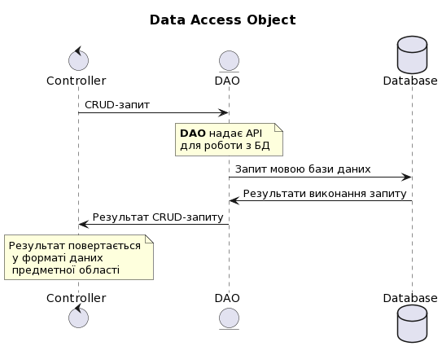
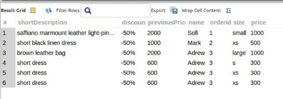
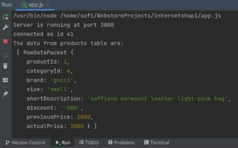
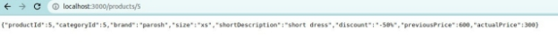
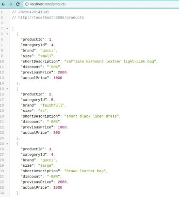

МІНІСТЕРСТВО ОСВІТИ І НАУКИ УКРАЇНИ

Національний Технічний Університет України

«Київський Політехнічний Інститут»

Факультет інформатики та обчислювальної техніки

Кафедра обчислювальної техніки

**Лабораторна робота №6**

з дисципліни «Організація баз даних»

**на тему: «Реалізація об’єктно-реляційного відображення»**

**Виконала:**

студентка 2-го курсу ФІОТ

групи ІО-з01

Манзенко С.С.

Залікова книжка №0111

**Перевірив:**

Доцент 

Кандидат технічних наук

Болдак О.А

**Київ – 2022**

**МЕТА:** Отримання навичок зі створення DAO-інфраструктури для доступу до MySQL баз даних.

**ДОВІДКА**

***DAO*** - об'єкт що надає абстрактний інтерфейс до деяких видів баз даних чи механізмів персистентності реалізуючи певні операції без розкриття деталей бази даних. Він надає відображення від програмних викликів до рівня персистентності. Така ізоляція розділює запити до даних в термінах предметної області та їх реалізацію засобами СКБД.

Персистентність - здатність стану існувати довше, ніж процес, що створив його. Без цієї можливості, стан може існувати лише в оперативній пам'яті і втрачається, коли оперативна пам'ять вимикається, наприклад, при вимкненні комп'ютера.

***Active Record*** - це шаблон проектування, що використовується при реалізації доступу до реляційних баз даних. Вперше згадується Мартіном Фаулером в книжці Patterns of Enterprise Application Architecture. Цей шаблон є підвидом DAO, але навідміну від нього, він надає CRUD API кожному окремому об'єкту, який репрезентує окремий запис в таблиці БД.

**Завдання**

1. Ознайомитись з призначенням шаблону Data Access Object
1. Створити базу даних у MySQL
1. Створити bean-класи по одному для кожної таблиці, які складаються з опису одного рядка таблиці.
1. Розробити DAO-інфраструктуру для роботи з базою даних.
1. Розробити програму для тестування можливостей DAO, яка створює деякі об’єкти в кожній таблиці та шукає існуючи їх по деяким ознакам.
1. Запустити програму та продивитись результати її роботи у MySQL.

ВИКОНАННЯ ЗАВДАНЬ

Створена база у MySQL

create database internetshop1;

-- userAccount

create table internetshop1.userAccount(

userId int primary key,

name varchar(50),

phone varchar(50),

email varchar(50)

);

-- one order

create table internetshop1.orders(

orderId int primary key,

userAccountId int,

foreign key (userAccountId) references userAccount(userId)

);

-- a product

create table internetshop1.products(

productId int primary key,

categoryId int,

brand varchar(50),

size varchar(50),

shortDescription varchar(255),

discount varchar(50),

previousPrice varchar(50),

actualPrice varchar(50)

);

create table internetshop1.orderItems(

orderItemsId int primary key,

productId int,

size varchar(50),

price varchar(50),

orderId int,

foreign key (productId) references products(productId),

foreign key (orderId) references orders(orderId)

);

-- change a datatype of the table`s column

USE internetshop1;

ALTER TABLE products MODIFY previousPrice INTEGER;

ALTER TABLE products MODIFY actualPrice INTEGER;

ALTER TABLE orderItems MODIFY price INTEGER;

-- how to delete the table

DROP table sys.Categories;

DROP table sys.userAccount;

DROP table internetshop1.userAccount;

DROP table internetshop1.orders;

DROP table internetshop1.Product;

-- to insert multiple values into the table

INSERT INTO internetshop1.userAccount(userId, name, phone, email)

values(1, 'Sofi', '5554477', 'sofi.mann99@gmail.com'),

(2, 'Mark', '88999777', 'mark@gmail.com'),

(3, 'Adrew', '8855666', 'andrew@gmail.com');

INSERT INTO internetshop1.orders(orderId, userAccountId)

values (1, 1), (2, 2), (3,3);

INSERT INTO internetshop1.products(productId, categoryId, brand, size, shortDescription, 

discount, previousPrice, actualPrice)

values(1, 4, 'gucci', 'small','saffiano marmount leather light-pink bag', '-50%', 1000, 2000),

(2, 5,'faithfull', 'xs', 'short black linen dress', '-50%', 1000, 500),

(3, 4, 'gucci', 'large', 'brown leather bag', '-50%', 2000, 1000),

(4, 5, 'selfportrait', 's', 'short dress', '-50%', 600, 300),

(5, 5, 'parosh', 'xs', 'short dress', '-50%', 600, 300);

-- to update data in the table column

SELECT \*

FROM products

WHERE productId=1;

UPDATE products

SET previousPrice = 2000, actualPrice = 1000

WHERE productId=1;

-- orders

INSERT INTO internetshop1.orderItems(orderItemsId, productId, size, price, orderId)

values(1, 1, 'small', 1000, 1),

(2, 2, 'xs', 500, 2),

(3, 3, 'large', 1000, 3);

-- to show orders of every user in database (if every user made only one order)

use internetshop1;

SELECT \* 

FROM orders o

JOIN userAccount ua

ON o.userAccountId = ua.userId

JOIN orderItems oi

ON oi.orderId = o.orderId

JOIN products p

ON p.productId = oi.productId;

-- user made two or more orders

INSERT INTO internetshop1.orderItems(orderItemsId, productId, size, price, orderId)

values(4, 4, 's', 300, 3),

(5, 5, 'xs', 300, 3),

(6, 5, 'xs', 300, 3);

use internetshop1;

SELECT 

p.shortDescription,

p.discount,

p.previousPrice,

ua.name,

o.orderId,

oi.size,

oi.price

FROM products p

JOIN orderItems oi

ON p.productId = oi.productId

JOIN orders o

ON o.orderId = oi.orderId

JOIN userAccount ua

ON o.userAccountId = ua.userId;

**РЕЗУЛЬТАТ У ВИГЛЯДІ ТОВАРІВ ПРЕДСТАВЛЕНИХ НА ДАНИЙ МОМЕНТ У БАЗІ ДАННИХ**

**DAO у цьому випадку грає роль сервер Node.js**

**Запит у базу даних код продемонстрований нижче**

// rewriting the code to support connection pooling

const express = require("express");

const app = express();

const mysql = require('mysql');

const pool = mysql.createPool({

`    `host     : 'localhost',

`    `user     : 'sofi',

`    `password : 'Password123#@!',

`    `database : 'internetshop1'

});

app.get("/",(req,res) => {

`    `pool.getConnection((err, connection) => {

`        `if(err) throw err;

`        `console.log('connected as id ' + connection.threadId);

`        `connection.query('SELECT \* from internetshop1.products LIMIT 1', (err, rows) => {

`            `connection.release(); // return the connection to pool

`            `if(err) throw err;

`            `console.log('The data from products table are: \n', rows);

`            `res.send(rows)

`        `});

`    `});

});

app.get("/products/:id", (req, res) => {

`    `pool.getConnection((err, connection) => {

`        `if(err) throw err;

`        `connection.query(SELECT \* from internetshop1.products WHERE productId = ${req.params.id}, (err, rows) => {

`            `connection.release(); // return the connection to pool

`            `if(err) throw err;

`            `res.send(rows[0])

`        `});

`    `});

})

app.get("/products", (req, res) => {

`    `pool.getConnection((err, connection) => {

`        `if(err) throw err;

`        `connection.query(SELECT \* from internetshop1.products, (err, rows) => {

`            `connection.release(); // return the connection to pool

`            `if(err) throw err;

`            `res.send(rows)

`        `});

`    `});

})

app.listen(3000, () => {

`    `console.log('Server is running at port 3000');

});

**Результат у браузері**

Якщо треба відобразити один товар

Якщо потрібно багато товарів

**ВИСНОВКИ**

Отримала навички зі створення DAO-інфраструктури для доступу до MySQL баз даних.
